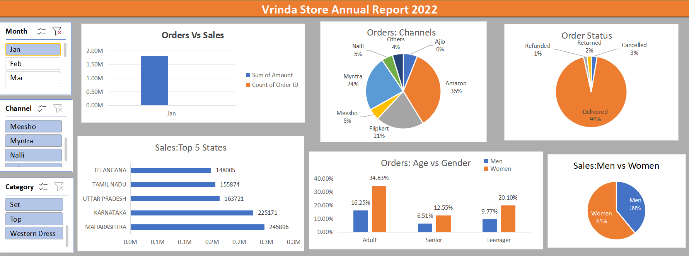

## Vrinda Store Annual Sales Report 2022

### Project Objective  
The goal of this analysis is to understand Vrinda Store’s sales performance over the past year — who their customers are, when and what they buy, and which sales channels perform best. These insights will empower Vrinda to optimize marketing efforts and boost sales in the coming year.

---

### Key Questions Explored  
- How did sales and order volumes fluctuate month-to-month throughout 2022?  
- Which month recorded the highest sales and order counts?  
- Who purchased more: men or women?  
- What were the different order statuses across the year?  
- Which top 10 states contributed the most to sales?  
- What is the relationship between customer age, gender, and order volume?  
- Which sales channels drove the most revenue?  
- Which product categories sold the best?

---

### Insights Gained  
- Women are the primary buyers, making up about **65% of total sales**.  
- Maharashtra, Karnataka, and Uttar Pradesh are the biggest contributors, together accounting for roughly **35% of sales**.  
- The 30-49 age group is the most active, responsible for nearly **50% of all orders**.  
- Amazon, Flipkart, and Myntra dominate sales channels, contributing around **80% of total revenue**.

---

### Recommendations  
Based on these insights, to fuel sales growth in 2023, Vrinda Store should:  
- Focus marketing campaigns on women aged 30-49 living in Maharashtra, Karnataka, and Uttar Pradesh.  
- Run targeted promotions, special offers, and discounts on Amazon, Flipkart, and Myntra, the most impactful sales channels.

---

## Tools & Techniques  
- Microsoft Excel (Dashboards, Pivot Tables, Charts)  
- Data cleaning and preparation to ensure accuracy and reliability

---

## How to Use This Project  
1. Open the Excel workbook to interact with the dashboards and explore visual insights.  
2. Use filters and slicers to drill down by month, location, gender, age group, or sales channel.  
3. Analyze different views to answer specific business questions.  
4. Apply insights and recommendations to shape marketing strategies and product focus.

---

## Dashboard Overview & Navigation

### Main Dashboard Sections  
- **Monthly Sales & Orders:** Visual comparison of sales revenue and number of orders per month.  
- **Customer Demographics:** Breakdown of purchases by gender and age group.  
- **Top States:** Bar chart showing the top 10 states by sales contribution.  
- **Sales Channels:** Pie chart illustrating revenue contribution by platforms like Amazon, Flipkart, and Myntra.  
- **Product Categories:** Analysis of highest selling product groups.

### Using Filters and Slicers  
- Use **month slicers** to focus on specific time periods.  
- Filter by **gender** or **age group** to analyze customer segments.  
- Select **states** to examine regional sales trends.  
- Toggle **sales channels** to identify high-performing platforms.

### Interactive Features  
- Hover over charts for detailed tooltips.  
- Click on data points to drill down into specifics.  
- Pivot tables and charts update dynamically based on selected filters.

---

## Screenshots

